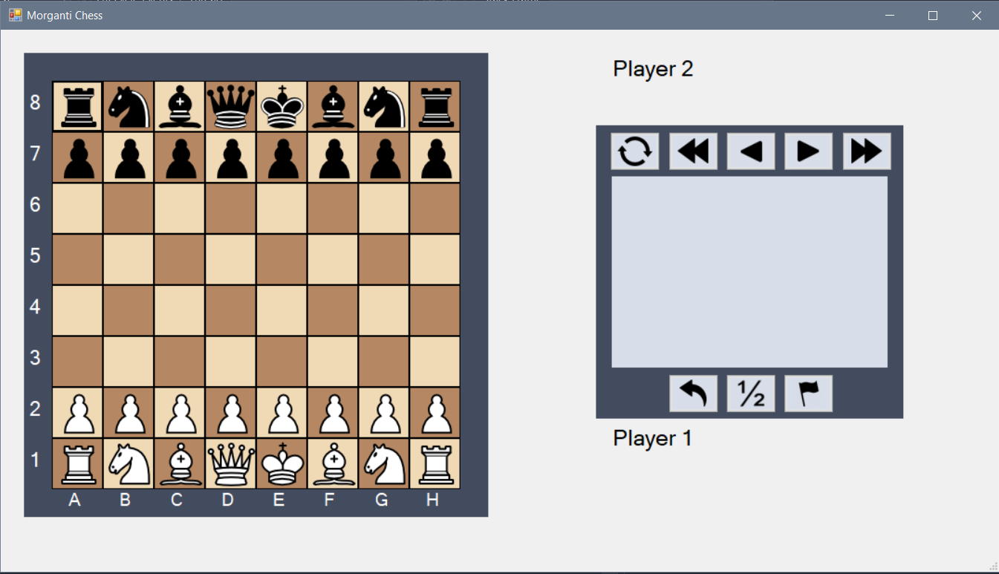
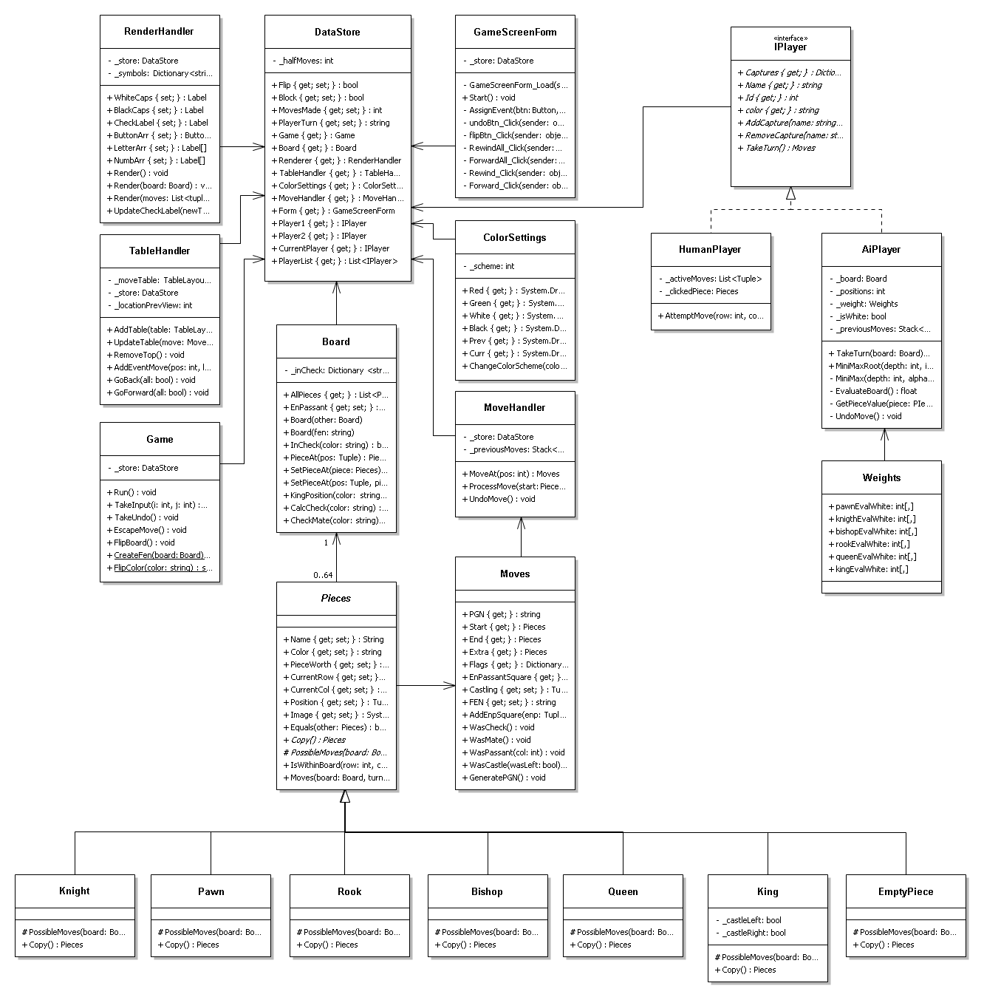

# CSC260-Final

For my CSC 260 Object Oriented Design class, I created Chess in C# using Windows forms for the final. 

Everything is created in an OOD fashion, with a try for SOLID principles. Within the code, everything is made into a class that encapsulates corresponding methods. I probably did not follow best practices, and some of my decisions could be simplified.

Currently the following work:
 * Proper piece movements
 * Check/Checkmate
 * Storing of previous moves (In PGN format)
 * Castling
 * En Passant
 * Ability to generate a FEN of the board
 * Ability to flip board
 * Ability to see past board positions

Things for the future:
 * Pawn promotion
 * Color Scheme (exists but cannot access beyond direct code)
 * Ability to save/load games
 * Instructions page
 * Better handling of checkmate
 * AI player (sorta implemented)
 * Concede/Tie buttons
 * In game menu

Here is a picture of the game: 

Here is the class diagram of the code:

